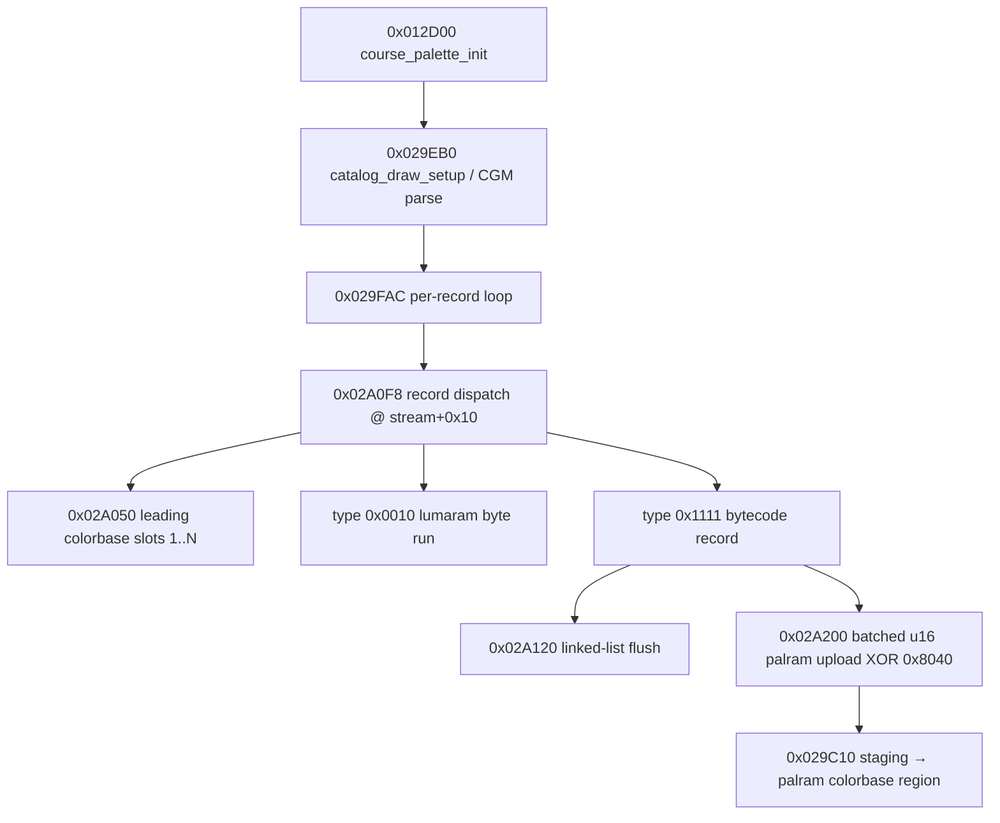

# Palette / CGM subsystem (Model 2, srallyc)

Runtime texture color on Model 2 is **not** in the texture ROM. Each textured polygon carries `colorbase` and `lumabase` indices; the rasterizer looks up:

1. `palram[0x1000 + colorbase]` → 5:5:5 bank selectors for R/G/B `colorxlat` tables
2. `lumaram[lumabase + (texel<<4)>>1]` → luma index (0..63) into those banks
3. `colorxlat` byte → 8-bit RGB (gamma baked at build: `geo_palette_lut_upload` @ `0x3C80`, `geo_lumaram_init` @ `0x4350`, scalars @ `0x5A2C70`/`0x5A2C74`)

Course-specific colors come from **CGM** (`"CGM 1.0 "`) blocks in `main_data`, parsed at runtime by maincpu code starting @ **`0x029EB0`**.

## Call graph (desert course init)



### libc / format compiler (type 0x1111 dependency)

| ROM | Role |
|-----|------|
| `0x05CEC0` | `printf` / thunk builder used during CGM parse |
| `0x05CE18` | scanf-like thunk setup |
| `0x05CF50` | Format-string compiler (`D`/`U` = u16, `E`/`f` = u32) |

Runtime thunks / stubs (workram):

| Workram | ROM mirror | Role |
|---------|------------|------|
| `0x005C8E60` | compare template | 8-byte `"CGM 1.0 "` gate (@ `0x29EDC`) |
| `0x005C8964` | `0x029964` `ret` | `0x029958` chain/return stub — **not** a filled upload body |
| `0x005C9118` | `0x02A118` `ret` | Alternate entry for `0x02A0F0`; `bal 0x02A0F8` skips it and returns to caller |
| `0x005C61C8` / `0x005C6250` | `ret` | `bal` return links for `0x027160` / `0x0271D0` (descriptor clear), not patch targets |

No static maincpu `st` writes into these stub cells. Upload semantics that **are** in ROM:

| ROM | Role |
|-----|------|
| `0x02A4E0` | Lone-`D` merge into packed bus `@ 0x01080000` (raw `g2`, **no** XOR) |
| `0x02A5A0` | FIFO runner — bit0 of flags → `0x02A4E0` |
| `0x02A200` | `#` batch XOR with **`0x8000`** only when `g3>0` |
| `0x029CFC` | `U` / pixmap ADD `g13` on `0x029C10` path |

### Upload cluster (static ROM — lifted)

| ROM | Lift | Role |
|-----|------|------|
| `0x02A2E0` | `cgm_digit_staging` | Seed merge bounds `@ 0x20C95C`–`968` (+ optional tile fill) |
| `0x02A4E0` | `palram_bus_merge_host` | Lone-`D` RMW into `@ 0x01080000` (raw `g2`) |
| `0x02A5A0` | `cgm_fifo_upload_runner` | Bresenham walk; bit0 → merge |
| `0x02A6D0` | `cgm_fifo_upload_wrapper` | Four permuted runner calls; payload = entry `g4` |
| `0x02A750` | `cgm_fifo_upload_span` | Column span of runner calls |
| `0x02A490` | `cgm_palette_scratch_write` | Scratch color15 chain |
| `0x02A120` | `cgm_1111_flush` | Scratch → `palram` via `0x26918` |

**Gap:** no static `call`/`bal` into `0x02A6D0` / `0x02A2E0` / `0x02A490` /
`0x02A750` from outside the upload cluster
(scan: `tools/decomp/palette_wrapper_unreachable_re.py`). External band hits are
only `0x02A7A0` (bus-list init). No ROM/main_data pointer immediates to the
wrapper either.

Bind/clone are **not** the `g4` publisher:

| ROM | Actual role |
|-----|-------------|
| `0x026F10` | Nest-depth push into 4×12-byte frames @ `0x20B1C0` (`lda (d)[d*2]` → `base+12*d`) |
| `0x026800` / `0x026860` | Memcpy job list @ `0x20B600`; boot via `0x014DC`→`0x026980`; only list publisher `bal 0x026868` @ `0x019F94` |
| Opcode `0x20` | Descriptor-bus emit @ `0x0270CC` (`0x8420`) — orthogonal to `0x20B1C0` |

`0x029950` (`lda 0x5C8964; bx`) also has zero static callers; `bal 0x029958` sites
are return gadgets.

**Lift interim (desert ~3k `D` atoms):** format handlers
`cgm_fifo_record(D/U)` → drain → `cgm_d_merge_commit` (raw `0x02A4E0` + scratch)
for `D`, ADD tile-place for `U`. Not `xor_table`. Wrapper bus coords still OPEN
(no static lead).


## CGM block layout (v16)

Desert course uses two blocks (loaded from `0x012D00`):

| Vaddr | Notes |
|-------|-------|
| `0x028AF104` | First course CGM |
| `0x028CCAF8` | Desert block — 13 leading colorbase slots, lumaram `0x0010` run, large `0x1111` record |

Record stream after header:

| Type | Handler | Effect |
|------|---------|--------|
| Leading colors | `0x02A050` | Slots 1..N direct color15 uploads |
| `0x0010` | lumaram copy | Byte run into `lumaram` |
| `0x1111` | `0x02A0F8` → `0x02A120` / `0x02A200` | Interleaved format fragments + binary atoms |

### Type `0x1111` payload shape

Not a flat `(slot, color15)` table. The desert block has ~400 inner `0x1111` markers splitting:

- **Binary chunks** — extend a shared parameter FIFO
- **Format chunks** — embedded strings like `3#333#DD3#UE…`:
  - `D` — read u16, **`0x02A4E0` merge with raw value** (not `0x02A258` XOR; that is `#` batch only)
  - `U` — read u16, ADD `g13` (@ `0x29CFC`)
  - `E` / `f` — read u32 parameters
  - `#` — seed `0x20C958` + batched XOR `@ 0x02A200` when `g3>0`

Geometry references **~189 palette slots ≥ 14**; slots 1–13 come from the leading header, slots ≥14 require successful `0x1111` replay.

## Hardware RAM mirrors (MAME)

| CPU addr | Size | Content |
|----------|------|---------|
| `0x01800000` | `0x4000` | `palram` |
| `0x01802000` | colorbase region | `palram[0x1000 + slot]` |
| `0x01810000` | `0xC000` | `colorxlat` R/G/B banks |
| `0x11400000` | `0x8000` | `lumaram` |

## Disasm slices (git: `decomp/disasm/`)

Python replay in `tools/model2_cgm_1111.py` walks the `0x1111` bytecode via
`tools/model2_cgm_staging.py` (disasm-backed scratch + ``0x26918`` commit):

1. **Stream pass** — interleaved binary atoms and format fragments. Deferred format
   fragments when the FIFO is empty (desert fragments 72–84 until chunk 86 binary).
2. **Pending drain** — retry deferred fragments after the full payload is visible.
3. **Completion sweep** — continue FIFO reads from the current cursor.
4. **Flush** — ``0x2A120`` merge @ ``0x20B950`` (``0x2A150`` chain copy + head adjust), then
   ``0x26918`` commits scratch slot range ``[r7+(head>>7), 0x20C950)``.

| Simulator entry | ROM | Effect |
|-----------------|-----|--------|
| `op_2a290_prepare_batch` | `0x2A290` | Seed `0x20C958` from cursor, +24 slots |
| `decode_rom_u16_xor` | `0x2A258` | `staging ^= (0x20C958|0x8040)` — mask from batch cursor only |
| `op_29cfc_add_staging` | `0x29CFC` | `staging += g13` (batched upload path) |
| `op_2a490_scratch_write` | `0x2A490` | Scratch @ `0x01800000` |
| `op_2a120_merge` / `op_2a120_commit` | `0x2A120` | Linked-list merge @ `0x20B950` then scratch range commit |
| `op_26918_commit` | `0x26918` | `palram[0x1000+slot]` |

| Entry | Slice | Status |
|-------|-------|--------|
| `0x012D00` | `maincpu/maincpu_012d00_200.asm` | done |
| `0x029EB0` | `maincpu/maincpu_029eb0_600.asm` | done |
| `0x029FAC` | `maincpu/maincpu_029f7c_100.asm` | done (record loop) |
| `0x029C10` | `maincpu/maincpu_029c10_800.asm` | done |
| `0x02A050` | `maincpu/maincpu_02a050_*.asm` | partial |
| `0x02A0F8` | `maincpu/maincpu_02a0f8_400.asm` | done (includes `0x2A200`) |
| `0x02A120` | `maincpu/maincpu_02a120_e0.asm` | done |
| `0x02A200` | (in `02a0f8_400.asm` @ `0x2A200`) | done |
| `0x05CF50` | `maincpu/maincpu_05cf50_a00.asm` | done |

## Validation ladder

Run: `./build palette` → `out/decomp/palette_report.json`

1. **Static replay** — `tools.model2_cgm.replay_course_cgm_blocks` fills leading + `0x1111` slots; test vectors for slots 1–13 and colorxlat bank0; geometry demand has no missing high slots.
2. **Visual verify** — atlas catalog / texture_verify previews; wrong hues on a single-binding region mean palram slot contents (CGM `0x1111` replay), not catalog binding.

## Python modules

| Module | Role |
|--------|------|
| `tools/model2_palette.py` | `PaletteState`, CGM discovery, colorxlat/lumaram init |
| `tools/model2_cgm.py` | Leading colors + record dispatch |
| `tools/model2_cgm_staging.py` | Disasm-backed scratch / ``0x26918`` staging simulator |
| `tools/model2_cgm_1111.py` | Type `0x1111` bytecode walker |
| `tools/decomp/palette_re.py` | `build palette` report |

## Open problems

- [x] Static `0x1111` replay fills placement-stream high slots (deferred format queue + completion sweep)
- [x] Leading slots 1–13 preserved (no FIFO rewind; slot writes capped at 0x3FF)
- [ ] **CGM `0x1111` slot contents** — staging sim with ``0x2A120`` merge; verify visually on cb477
- [ ] Forest / mountain / championship CGM paths (additional `COURSE_CGM_VADDRS`)

## Test vectors

Desert CGM header slots (from static parse — verify after replay):

```
slot 1..13: leading colorbase block @ 0x028CCAF8
slot >= 14: 0x1111 record only
```

Placement stream colorbase demand: first 200 placements sampled by `palette_re.sample_geometry_colorbases`.
